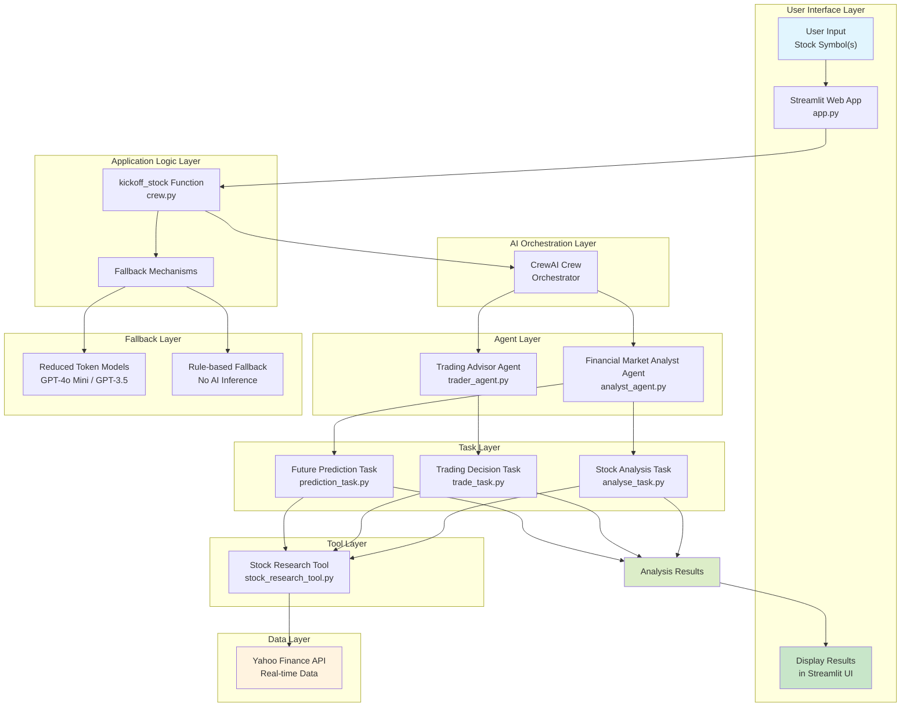

# Crew AI Stock Analysis

An AI-powered stock analysis application built with CrewAI, Streamlit, and real-time market data. This project leverages multiple AI agents to provide comprehensive stock analysis, trading recommendations, and future performance predictions.

## 🚀 Features

- **Single Stock Analysis**: Analyze individual stock symbols with detailed insights
- **Batch Analysis**: Process multiple stocks simultaneously with progress tracking
- **AI-Powered Insights**: Uses CrewAI agents for intelligent analysis
- **Real-Time Data**: Integrates with Yahoo Finance for current market data
- **Trading Recommendations**: Strategic buy/sell/hold decisions based on analysis
- **Future Predictions**: AI-driven forecasts for 1-3 month performance
- **Fallback Mechanisms**: Automatic handling of API limits with rule-based alternatives
- **Interactive UI**: Streamlit-based web interface for easy use

## 🛠️ Installation

1. **Clone the repository:**
   ```bash
   git clone https://github.com/yourusername/crew-ai-stock-analysis.git
   cd crew-ai-stock-analysis
   ```

2. **Create a virtual environment:**
   ```bash
   python -m venv venv
   source venv/bin/activate  # On Windows: venv\Scripts\activate
   ```

3. **Install dependencies:**
   ```bash
   pip install -r requirements.txt
   ```

4. **Set up environment variables:**
   Create a `.env` file in the root directory and add your API keys:
   ```
   GROQ_API_KEY=your_groq_api_key
   OPENAI_API_KEY=your_openai_api_key
   ```

## 📋 Prerequisites

- Python 3.8+
- API keys for Groq and OpenAI (for AI model access)

## 🚀 Usage

### Running the Application

```bash
streamlit run app.py
```

### Single Stock Analysis

1. Open the application in your browser
2. Select the "Single Stock" tab
3. Enter a stock symbol (e.g., AAPL)
4. Click "Analyze Stock" to get comprehensive analysis

### Batch Analysis

1. Select the "Batch Analysis" tab
2. Enter multiple stock symbols separated by commas
3. Use preset buttons for quick stock selection (Tech, Finance, etc.)
4. Click "Analyze Multiple Stocks" to process all symbols

## 🏗️ Project Structure

```
crew-ai-stock-analysis/
├── app.py                    # Main Streamlit application
├── crew.py                   # CrewAI crew configuration and logic
├── batch_analysis.py         # Batch processing functionality
├── main.py                   # Alternative entry point
├── requirements.txt          # Python dependencies
├── agents/
│   ├── analyst_agent.py      # Financial analyst AI agent
│   └── trader_agent.py       # Trading decision AI agent
├── tasks/
│   ├── analyse_task.py       # Stock analysis task
│   ├── trade_task.py         # Trading recommendation task
│   └── prediction_task.py    # Future prediction task
└── tools/
    └── stock_research_tool.py # Stock data retrieval tools
```

## 🏗️ Architecture and Flow

The application follows a multi-agent architecture using CrewAI, with specialized agents working together to provide comprehensive stock analysis.

### System Architecture

> 📋 **Interactive Diagram**: Open [`architecture_diagram.html`](architecture_diagram.html) in your browser for a fully interactive, visually enhanced version of this diagram.



### Data Flow

1. **User Interaction**: User enters stock symbol(s) via Streamlit interface
2. **Processing Initiation**: `kickoff_stock()` function initializes the CrewAI crew
3. **Agent Coordination**: CrewAI orchestrates multiple agents to perform specialized tasks
4. **Data Retrieval**: Agents use tools to fetch real-time stock data from Yahoo Finance
5. **Analysis Execution**: 
   - Analyst Agent performs market analysis
   - Trader Agent generates trading recommendations
   - Analyst Agent provides future performance predictions
6. **Result Aggregation**: All task outputs are combined into comprehensive analysis
7. **Fallback Handling**: If AI models hit limits, system automatically falls back to simpler models or rule-based analysis
8. **Display**: Results are presented in the Streamlit web interface

### Key Components

- **Agents**: Specialized AI entities with specific roles and expertise
- **Tasks**: Defined objectives that agents work to accomplish
- **Tools**: Utilities for data retrieval and external API interactions
- **Crew**: Orchestration layer that manages agent-task interactions
- **Fallback System**: Ensures reliability by providing alternative analysis methods

## 🤖 AI Agents

- **Financial Market Analyst**: Performs in-depth stock evaluations using real-time data
- **Trading Advisor**: Provides strategic buy/sell/hold recommendations
- **Prediction Specialist**: Forecasts future stock performance

## 🔧 Configuration

The application uses multiple LLM configurations for robustness:
- Primary: Groq Llama 3.3 70B
- Fallback: GPT-4o Mini
- Normal: GPT-3.5 Turbo

Automatic fallback ensures analysis continues even with API limitations.

## 📊 Data Sources

- **Yahoo Finance**: Real-time stock prices, historical data, and market information
- **AI Models**: Groq and OpenAI for intelligent analysis and predictions

## 🤝 Contributing

1. Fork the repository
2. Create a feature branch (`git checkout -b feature/amazing-feature`)
3. Commit your changes (`git commit -m 'Add some amazing feature'`)
4. Push to the branch (`git push origin feature/amazing-feature`)
5. Open a Pull Request

## 📝 License

This project is licensed under the MIT License - see the [LICENSE](LICENSE) file for details.

## ⚠️ Disclaimer

This application is for educational and informational purposes only. It should not be considered as financial advice. Always consult with a qualified financial advisor before making investment decisions.

## 🙏 Acknowledgments

- [CrewAI](https://www.crewai.com/) - Multi-agent framework
- [Streamlit](https://streamlit.io/) - Web app framework
- [Yahoo Finance](https://finance.yahoo.com/) - Financial data provider
- [Groq](https://groq.com/) and [OpenAI](https://openai.com/) - AI model providers</content>
<parameter name="filePath">e:\AI Projects\Crew AI_Stock_Analysis\README.md